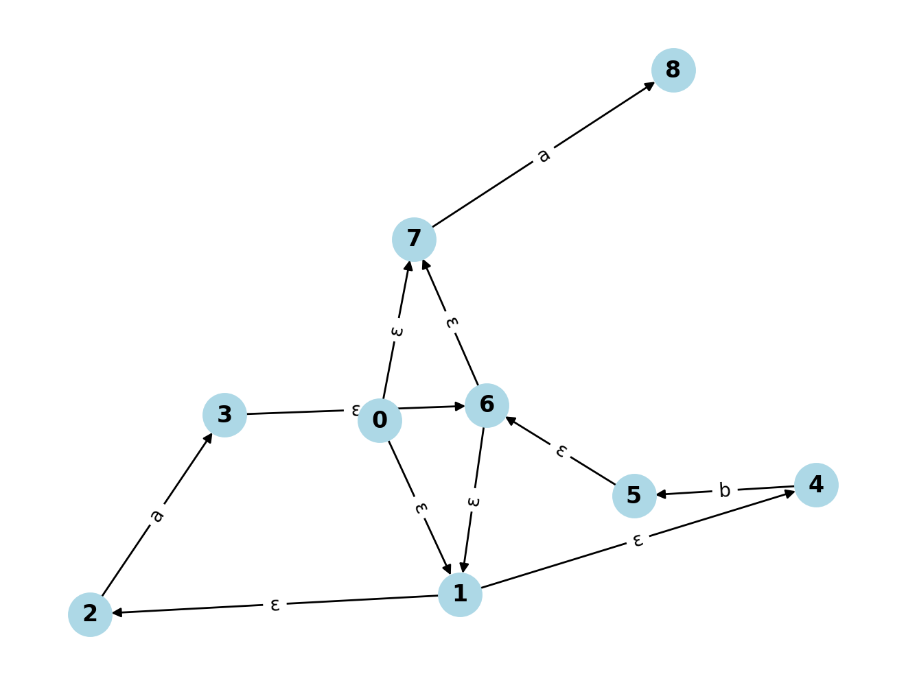

# e-NFA-transition-generator-app

This project is a web app that generates an epsilon-NFA (e-NFA) Transition Table from a given regular expression. The tool simplifies the manual process of building an e-NFA table by automating it, requiring just a click. The generator efficiently uses stacks as data structures, minimizing errors and effort for users.

## Features

- **Automatic e-NFA generation:** Converts a regular expression into its corresponding epsilon-NFA transition table.
- **Efficient stack-based implementation:** Utilizes stacks to process the regular expression and generate transitions.
- **User-friendly Interface:** Built with a simple web interface for easy usage, allowing users to input a regular expression and view the results instantly.
- **Streamlined workflow:** Reduces manual effort and errors, making it a valuable tool for students and professionals dealing with automata theory.

## Tech Stack

- **Frontend:** Streamlit (Python-based web framework)
- **Backend Logic:** Data Structures and Algorithms (Stacks for handling regular expressions)
- **Deployment:** Python

## How It Works

1. Go to URL
   ```bash
   https://iamsahilkansal-e-nfa-transition-generator-app.streamlit.app/
   ```
3. The user inputs a regular expression into the provided field.
4. The app processes the regular expression using stacks to break it down into components.
5. The e-NFA transition table is generated and displayed on the screen.

## Getting Started

### Prerequisites

- **Python 3.x** installed on your system.
- **Streamlit** library for building the web interface.

### Installation

1. Clone this repository:

   ```bash
   git clone https://github.com/iamsahilkansal/e-NFA-transition-generator-app.git
   ```
2. Navigate to the project directory:

   ```bash
   cd e-NFA-transition-generator-app
   ```
3. Install the required dependencies:

   ```bash
   pip install -r requirements.txt
   ```
4. Run the Streamlit app:

   ```bash
   streamlit run app.py
   ```

### Usage

- After running the app, you will see a web interface in your browser.
- Enter the regular expression in the input field.
- The app will automatically generate the corresponding e-NFA transition table.
- View the results on the page.

|  |  |  |
| - | - | - |

## Regular Expression: `(a|b)*.a`

### e-NFA Transition Table

| **Start State** | **End State** | **Transition** |
| --------------------- | ------------------- | -------------------- |
| q[0]                  | q[1]                | ε                   |
| q[0]                  | q[7]                | ε                   |
| q[1]                  | q[2]                | ε                   |
| q[1]                  | q[4]                | ε                   |
| q[2]                  | q[3]                | a                    |
| q[3]                  | q[6]                | ε                   |
| q[4]                  | q[5]                | b                    |
| q[5]                  | q[6]                | ε                   |
| q[6]                  | q[1]                | ε                   |
| q[6]                  | q[7]                | ε                   |
| q[7]                  | q[8]                | a                    |

### e-NFA Transition Graph



## Contributing

Feel free to fork this repository and contribute by submitting a pull request. Any improvements in efficiency, features, or UI are welcome!

## Contact

If you have any questions or feedback, feel free to reach out:

- **Email:** kansalsahil51@gmail.com
- **GitHub:** [iamsahilkansal](https://github.com/iamsahilkansal)
